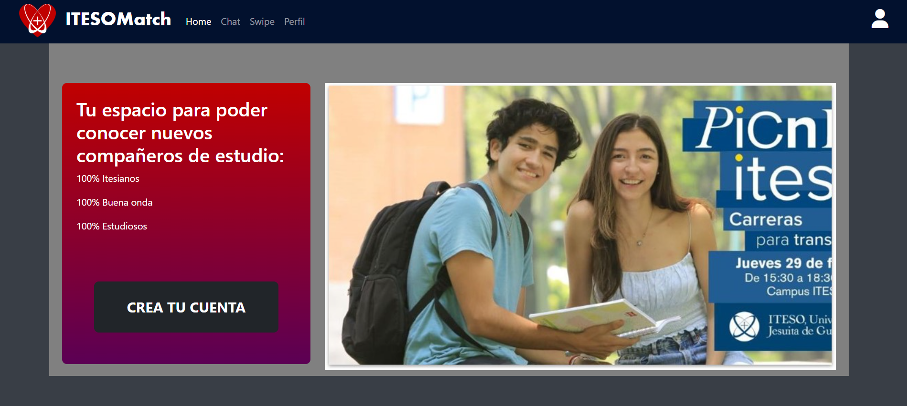
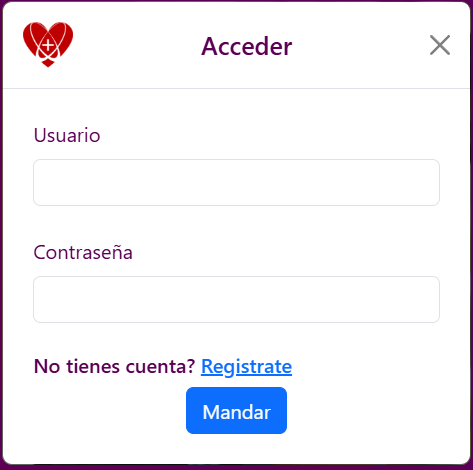
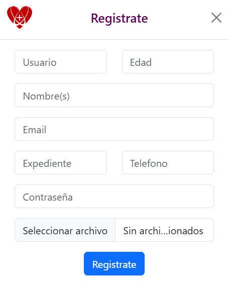
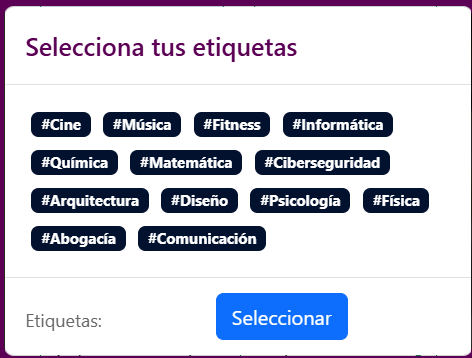
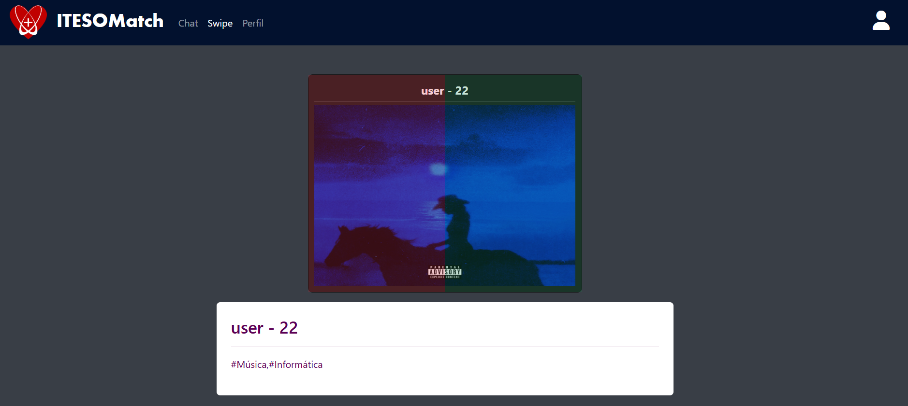
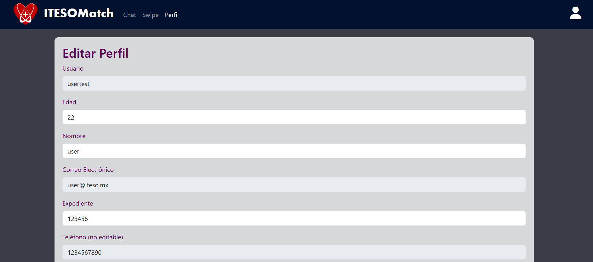

# ITESOMatch

<div align="center">
  
  <p><strong>Tu espacio para conocer nuevos compañeros de estudio</strong></p>
  <p>100% Itesianos | 100% Buena onda | 100% Estudiosos</p>
</div>

---

## Descripción

**ITESOMatch** es una aplicación web de matching social diseñada específicamente para los estudiantes del ITESO. Similar a aplicaciones de citas, ITESOMatch permite a los estudiantes conectarse con compañeros que comparten intereses académicos y personales similares mediante un sistema de swipe y matching basado en etiquetas (tags).

La plataforma ofrece un ambiente seguro y exclusivo para la comunidad Itesiana donde los estudiantes pueden:
- Descubrir otros estudiantes con intereses similares
- Hacer swipe para indicar interés en conectar
- Chatear en tiempo real cuando hay un match mutuo
- Gestionar su perfil personalizado con foto y etiquetas de interés

## Características Principales

- **Sistema de Matching Inteligente**: Algoritmo que ordena perfiles basándose en similitud de tags/intereses
- **Swipe Interface**: Interfaz intuitiva de deslizamiento para explorar perfiles
- **Chat en Tiempo Real**: Mensajería instantánea con Socket.IO cuando hay match mutuo
- **Autenticación Segura**: Sistema de login con JWT y contraseñas encriptadas con bcrypt
- **Perfiles Personalizados**: Cada usuario puede agregar foto, información personal y tags de intereses
- **Validación de Estudiantes ITESO**: Registro con número de expediente institucional

## Requerimientos

### Software Necesario
- **Node.js**: v14.x o superior
- **MongoDB**: v4.4 o superior (local o MongoDB Atlas)
- **npm** o **yarn**: Para gestión de paquetes
- **Navegador Web Moderno**: Chrome, Firefox, Safari o Edge (versiones recientes)

### Variables de Entorno
Crear un archivo `.env` en el directorio `server/` con las siguientes variables:

```env
PORT=3000
JWT_SECRET=tu_secreto_jwt_aqui
DB_URI_DEV=mongodb://localhost:27017/itesoMatch
DB_URI=mongodb://tu_uri_de_produccion_aqui
NODE_ENV=dev
```

## Herramientas y Tecnologías Utilizadas

### Backend
- **Node.js** - Entorno de ejecución de JavaScript
- **Express.js** - Framework web minimalista
- **MongoDB** - Base de datos NoSQL
- **Mongoose** - ODM para MongoDB
- **Socket.IO** - Comunicación en tiempo real bidireccional
- **JWT (jsonwebtoken)** - Autenticación basada en tokens
- **bcrypt** - Encriptación de contraseñas
- **Morgan** - Logger HTTP para desarrollo
- **CORS** - Middleware para habilitar CORS
- **Cookie-Parser** - Parse de cookies
- **Express-FileUpload** - Manejo de subida de archivos

### Frontend
- **HTML5** - Estructura de páginas
- **CSS3** - Estilos y diseño responsivo
- **JavaScript (ES6+)** - Lógica del cliente
- **Bootstrap 5.3** - Framework CSS para diseño responsivo
- **Font Awesome** - Iconos
- **Socket.IO Client** - Cliente para comunicación en tiempo real
- **jQuery** - Manipulación del DOM y AJAX

### DevTools
- **Nodemon** - Reinicio automático del servidor en desarrollo
- **ESLint** - Linter para mantener código consistente
- **Cross-env** - Variables de entorno multiplataforma

## Dependencias

### Dependencias de Producción

```json
{
  "bcrypt": "^5.1.1",
  "cookie-parser": "^1.4.6",
  "cors": "^2.8.5",
  "dotenv": "^16.4.5",
  "express": "^4.19.2",
  "express-fileupload": "^1.5.0",
  "jsonwebtoken": "^9.0.2",
  "mongoose": "^8.3.2",
  "morgan": "^1.10.0",
  "socket.io": "^4.7.5"
}
```

### Dependencias de Desarrollo

```json
{
  "cross-env": "^7.0.3",
  "eslint": "^8.57.0",
  "eslint-config-standard": "^17.1.0",
  "eslint-plugin-import": "^2.29.1",
  "eslint-plugin-n": "^16.6.2",
  "eslint-plugin-promise": "^6.1.1",
  "nodemon": "^3.1.0"
}
```

## Estructura del Proyecto

```
ItesoMatch_Testing/
├── server/
│   ├── client/                    # Frontend estático
│   │   ├── assets/               # Imágenes y recursos
│   │   └── views/                # Páginas HTML, CSS y JS
│   │       ├── home.html         # Página principal/landing
│   │       ├── swipe.html        # Vista de swipe
│   │       ├── chat.html         # Vista de chat
│   │       ├── profile.html      # Vista de perfil
│   │       └── *.js, *.css       # Scripts y estilos
│   ├── modules/                  # Módulos de backend
│   │   ├── users/                # Gestión de usuarios
│   │   ├── swipe/                # Lógica de matching
│   │   ├── chats/                # Sistema de chat
│   │   ├── messages/             # Modelo de mensajes
│   │   └── shared/match/         # Modelo de matches
│   ├── middlewares/              # Middlewares personalizados
│   │   ├── userAuth.js           # Autenticación de usuarios
│   │   └── admin.js              # Autenticación de admin
│   ├── utils/                    # Utilidades
│   │   └── config.js             # Configuración del servidor
│   ├── img/                      # Imágenes subidas por usuarios
│   ├── app.js                    # Configuración de Express
│   ├── index.js                  # Punto de entrada
│   ├── router.js                 # Rutas principales
│   └── package.json              # Dependencias
├── .gitignore
└── README.md
```

## Cómo Correr la Aplicación

### 1. Clonar el Repositorio

```bash
git clone <url-del-repositorio>
cd ItesoMatch_Testing
```

### 1.1. Crear la carpeta 'img'
```bash
cd server
mkdir img
```

### 2. Instalar Dependencias

```bash
npm install
```

### 3. Configurar Variables de Entorno

Crear un archivo `.env` en el directorio `server/`:

```bash
cd server
touch .env
```

Agregar las siguientes variables (ajustar según tu configuración):

```env
PORT=3000
JWT_SECRET=tu_secreto_jwt_seguro
DB_URI_DEV=mongodb://localhost:27017/itesoMatch
DB_URI=mongodb://localhost:27017/itesoMatch
NODE_ENV=dev
```

### 4. Iniciar MongoDB

Asegúrate de que MongoDB esté corriendo:

```bash
# Si usas MongoDB local
mongod
```

O configura MongoDB Atlas y actualiza `DB_URI` en el archivo `.env`.

### 5. Iniciar el Servidor

#### Modo Desarrollo (con auto-reload)
```bash
npm run dev
```

#### Modo Producción
```bash
npm start
```

### 6. Acceder a la Aplicación

Abre tu navegador y ve a:
```
http://localhost:3000/client/views/home.html
```

## Uso de la Aplicación

### Registro de Usuario
1. En la página principal, haz clic en "CREA TU CUENTA"
2. Completa el formulario con tu información:
   - Usuario
   - Nombre completo
   - Edad
   - Email
   - Número de expediente ITESO
   - Teléfono
   - Contraseña
   - Foto de perfil
3. Selecciona tus tags/intereses
4. Haz clic en "Registrate"

### Login
1. Haz clic en el icono de usuario en la barra de navegación
2. Ingresa tu usuario y contraseña
3. Accede a las funcionalidades principales

### Swipe y Matching
1. Ve a la sección "Swipe" en el menú
2. Desliza sobre los perfiles de otros estudiantes
3. Los perfiles están ordenados por similitud de intereses
4. Cuando hay match mutuo, se crea automáticamente un chat

### Chat en Tiempo Real
1. Ve a la sección "Chat" en el menú
2. Selecciona una conversación de tu lista de matches
3. Envía mensajes en tiempo real
4. Los mensajes se sincronizan instantáneamente vía WebSockets

## API Endpoints

### Usuarios (`/api/users`)
- `POST /register` - Registro de nuevo usuario
- `POST /login` - Inicio de sesión
- `GET /me` - Obtener perfil del usuario autenticado

### Swipe (`/api/swipe`)
- `GET /top-matches` - Obtener lista de usuarios sugeridos (ordenados por similitud)
- `POST /like` - Dar like a un usuario

### Chats (`/api/chats`)
- `GET /` - Obtener todos los chats del usuario
- `GET /:chatId` - Obtener mensajes de un chat específico
- `POST /:chatId/message` - Enviar mensaje a un chat

## WebSocket Events

### Cliente → Servidor
- `connection` - Establecer conexión (requiere token JWT)
- `message` - Enviar mensaje con `{ chatId, targetId, message }`

### Servidor → Cliente
- `new-message` - Recibir nuevo mensaje con `{ chatId, message }`

## Cómo Contribuir

¡Contribuciones son bienvenidas! Para contribuir al proyecto:

### 1. Fork del Proyecto
Haz fork del repositorio a tu cuenta de GitHub.

### 2. Crear una Rama
```bash
git checkout -b feature/nueva-funcionalidad
```

### 3. Realizar Cambios
- Escribe código limpio y bien documentado
- Sigue las convenciones de estilo existentes
- Ejecuta el linter antes de commit:
  ```bash
  npm run lint
  ```

### 4. Commit de Cambios
```bash
git add .
git commit -m "Descripción clara de los cambios"
```

### 5. Push a tu Fork
```bash
git push origin feature/nueva-funcionalidad
```

### 6. Crear Pull Request
- Ve a GitHub y crea un Pull Request
- Describe detalladamente los cambios realizados
- Espera revisión y feedback

### Guías de Contribución

- **Código**: Sigue el estilo de código existente (Standard JS)
- **Commits**: Usa mensajes descriptivos en español
- **Ramas**: Usa nombres descriptivos (feature/, bugfix/, hotfix/)
- **Testing**: Agrega tests cuando sea apropiado
- **Documentación**: Actualiza el README si agregas nuevas funcionalidades

### Reportar Bugs

Si encuentras un bug:
1. Verifica que no haya sido reportado previamente
2. Crea un Issue con:
   - Descripción clara del problema
   - Pasos para reproducir
   - Comportamiento esperado vs actual
   - Screenshots si es aplicable
   - Información del entorno (OS, navegador, etc.)

## Mockups / Vistas de la Aplicación

### Vista Principal (Home)


La página principal presenta:
- Barra de navegación con el logo
- Página de presentación
- Call-to-action para crear cuenta
- Acceso a modales de registro y login también con botón de arriba a la derecha

### Diálogo de Login


El modal de inicio de sesión incluye:
- Formulario sencillo con usuario y contraseña
- Diseño limpio y minimalista
- Integración con el sistema de autenticación JWT
- Para usuarios ya registrados

### Diálogo de Registro


El formulario de registro permite:
- Captura de información completa del usuario
- Campos: Usuario, nombre, edad, email, expediente ITESO, teléfono, contraseña
- Subida de foto de perfil
- Validación de estudiantes ITESO mediante número de expediente

### Selección de Tags/Intereses


La interfaz de selección de tags permite:
- Elegir múltiples intereses personales y académicos
- Tags categorizados para mejor organización
- Base para el algoritmo de matching por similitud

### Vista de Swipe


La interfaz de swipe permite:
- Visualizar perfiles de otros estudiantes con foto, nombre, edad e intereses
- Sistema de deslizamiento para indicar interés (like/dislike)
- Algoritmo de ordenamiento por similitud de tags
- Cuando hay match mutuo, se crea automáticamente un chat
- **Nota importante**: Esta pantalla solo está disponible cuando hay al menos 2 usuarios registrados en la aplicación

### Edición de Perfil


La vista de perfil permite al usuario:
- Ver y editar su información personal
- Actualizar foto de perfil
- Modificar tags de intereses
- Gestionar su cuenta y preferencias

### Paleta de Colores

```
#02112E - Azul oscuro (navbar)
#5B0054 - Morado oscuro
#C00000 - Rojo ITESO
#393E46 - Gris oscuro (fondo)
#131313 - Negro
#EEEEEE - Blanco/gris claro
```

---

## Licencia

Este proyecto fue desarrollado como parte de un proyecto académico en el ITESO.

## Contacto

Para preguntas o sugerencias sobre el proyecto, por favor abre un Issue en el repositorio.

---

<div align="center">
  <p>Desarrollado con ❤️ para la comunidad ITESO</p>
  
</div>

---

Por si sale un error de que el puerto ya está en uso (detiene todos los procesos de node para liberar el puerto)

Get-Process -Name node | Stop-Process -Force

Para ejecutar las pruebas de backend:
cd server
npm test